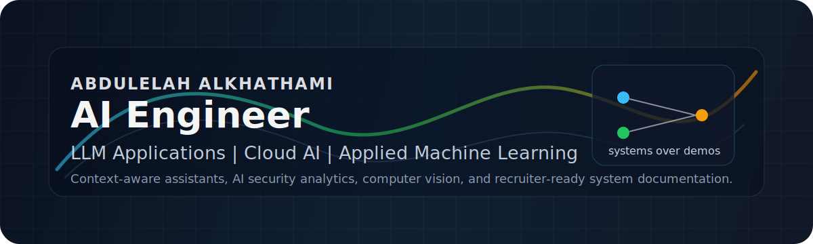

  

# Abdulelah Alkhathami

**AI Engineer focused on LLM applications, applied machine learning, Cloud AI, and production-minded AI systems.**

[Website](https://abdulelah.de) | [LinkedIn](https://linkedin.com/in/abdulelah-alkhathami-853845311) | [GitHub](https://github.com/Abdulel3h) | [Email](mailto:me@abdulelah.de)

I build AI projects that connect real users, domain context, and deployable software. My strongest work sits at the intersection of Arabic-first AI experiences, context-aware assistants, intelligent search, security analytics, computer vision, and cloud architecture.

## What I Build

| Area | What it means in my work |
| --- | --- |
| LLM applications | Local and cloud-oriented assistants that use domain context instead of generic chatbot behavior. |
| Applied machine learning | Prototypes for anomaly-style detection, computer vision, behavioral analytics, and decision support. |
| Cloud AI | Systems designed around APIs, deployment paths, storage, observability, and managed AI services. |
| Arabic AI products | Interfaces and knowledge flows built for Arabic-first users and bilingual product contexts. |
| Engineering communication | READMEs, architecture notes, tradeoffs, and limitations that help reviewers understand the system quickly. |

## Featured AI Systems

| Project | Engineering focus | Why it matters |
| --- | --- | --- |
| [Abdulelah AI Portfolio](https://github.com/Abdulel3h/Abdulelah) | Next.js, TypeScript, structured content, SEO, portfolio assistant | Connects the website, project case studies, role-specific resumes, and AI assistant into one portfolio system. |
| [ChatUB](https://github.com/Abdulel3h/ChatUB) | Arabic LLM assistant, semantic search, local AI, Flask, Ollama | Demonstrates how a university-specific assistant can answer student questions using trusted academic content. |
| [Absher Insight AI](https://github.com/Abdulel3h/absher-insight) | AI security analytics, FastAPI, synthetic behavior data, anomaly-style rules | Explores proactive risk detection for government-style digital services without exposing real user data. |
| [Architect of Intelligence](https://github.com/Abdulel3h/architect-of-intelligence) | TanStack Start, TypeScript, structured AI workflows, Zod validation | Shows modern AI platform architecture with server-side validation, bilingual output, and fallback behavior. |
| [Stadium Gate Monitor](https://github.com/Abdulel3h/Stadium) | YOLO, OpenCV, Flask APIs, operations dashboard | Applies computer vision to crowd monitoring, gate status, alerting, and staff-distribution decisions. |
| [Alpha AI Innovations](https://github.com/Abdulel3h/alpha-ai-innovations) | Arabic AI advisory concept, React, TanStack Router, structured service catalog | Shows Arabic-first AI product thinking with conservative prototype boundaries and documented validation gaps. |

## Engineering Philosophy

I prefer AI systems that are understandable, constrained, and useful:

- Ground responses in real domain material whenever possible.
- Separate prototypes from production claims.
- Design data boundaries before model behavior.
- Make APIs, fallbacks, and failure modes explicit.
- Document architecture, setup, limitations, and future work.
- Avoid invented metrics, inflated achievements, or vague AI language.

## Technical Stack

| Layer | Tools and concepts |
| --- | --- |
| AI and data | Python, NLP, LLM applications, semantic search, SentenceTransformers, anomaly detection, computer vision |
| Backend | FastAPI, Flask, API route design, Pydantic, Zod, REST-style services |
| Frontend | TypeScript, React, Next.js, TanStack Start, Vite, Tailwind CSS |
| Cloud and deployment | Google Cloud exposure, Azure AI Services exposure, Vercel, Cloud Run concepts, Cloud Storage concepts, BigQuery concepts |
| Product delivery | Arabic-first UX, technical writing, architecture diagrams, dashboard design, privacy-aware flows |

## Repository Map

| Category | Repositories |
| --- | --- |
| Flagship AI projects | [ChatUB](https://github.com/Abdulel3h/ChatUB), [absher-insight](https://github.com/Abdulel3h/absher-insight), [architect-of-intelligence](https://github.com/Abdulel3h/architect-of-intelligence), [Stadium](https://github.com/Abdulel3h/Stadium) |
| Portfolio system | [Abdulelah](https://github.com/Abdulel3h/Abdulelah) |
| Hackathon and product concepts | [alpha-ai-innovations](https://github.com/Abdulel3h/alpha-ai-innovations), [midad-landing](https://github.com/Abdulel3h/midad-landing) |
| Archived learning projects | Older static exercises, placeholders, duplicates, and incomplete scaffolds are intentionally not highlighted. |

Detailed ranking and curation notes: [Repository Strategy](./docs/repository-strategy.md)

Recruiter review sequence: [Recruiter Review Path](./docs/recruiter-review-path.md)

## Recommended Review Path

If you are evaluating my work for an AI engineering role, start here:

1. [ChatUB](https://github.com/Abdulel3h/ChatUB) for LLM and Arabic NLP work.
2. [absher-insight](https://github.com/Abdulel3h/absher-insight) for AI security and decision-support thinking.
3. [architect-of-intelligence](https://github.com/Abdulel3h/architect-of-intelligence) for TypeScript AI platform architecture.
4. [Stadium](https://github.com/Abdulel3h/Stadium) for computer vision and operational dashboards.
5. [Abdulelah](https://github.com/Abdulel3h/Abdulelah) for the full portfolio system and technical presentation.
6. [alpha-ai-innovations](https://github.com/Abdulel3h/alpha-ai-innovations) for Arabic AI product and advisory-service concept work.

## Public Portfolio Standard

I keep public claims conservative. Projects are documented with:

- What the system does
- What architecture it uses
- What is prototype-level
- What needs more evaluation
- What should be improved before production use

Internal or employer-owned work is not used as public portfolio evidence.

## Contact

- Website: [abdulelah.de](https://abdulelah.de)
- LinkedIn: [linkedin.com/in/abdulelah-alkhathami-853845311](https://linkedin.com/in/abdulelah-alkhathami-853845311)
- GitHub: [github.com/Abdulel3h](https://github.com/Abdulel3h)
- Email: [me@abdulelah.de](mailto:me@abdulelah.de)
