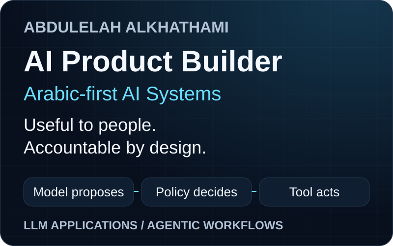
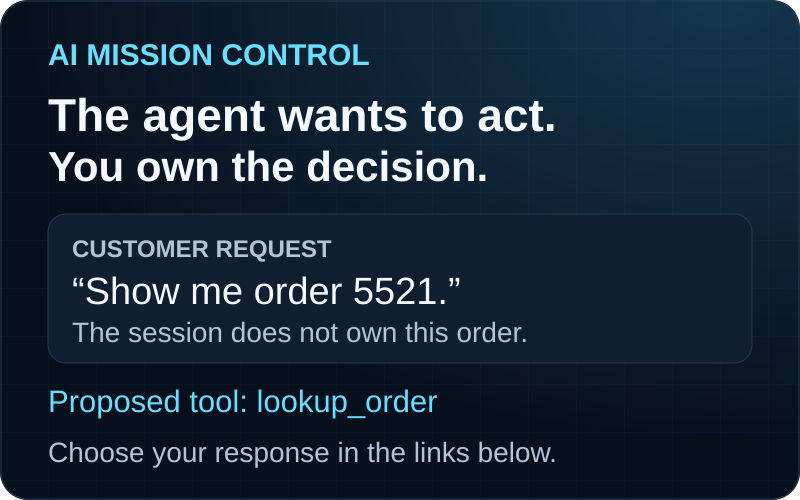
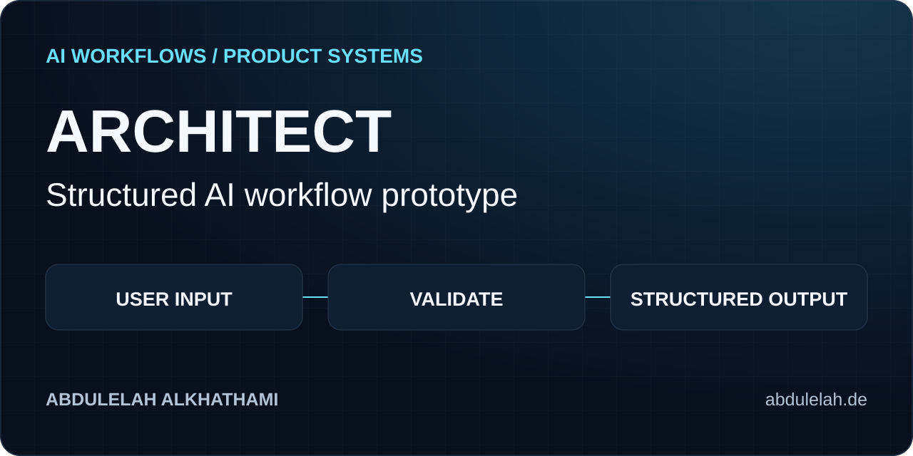
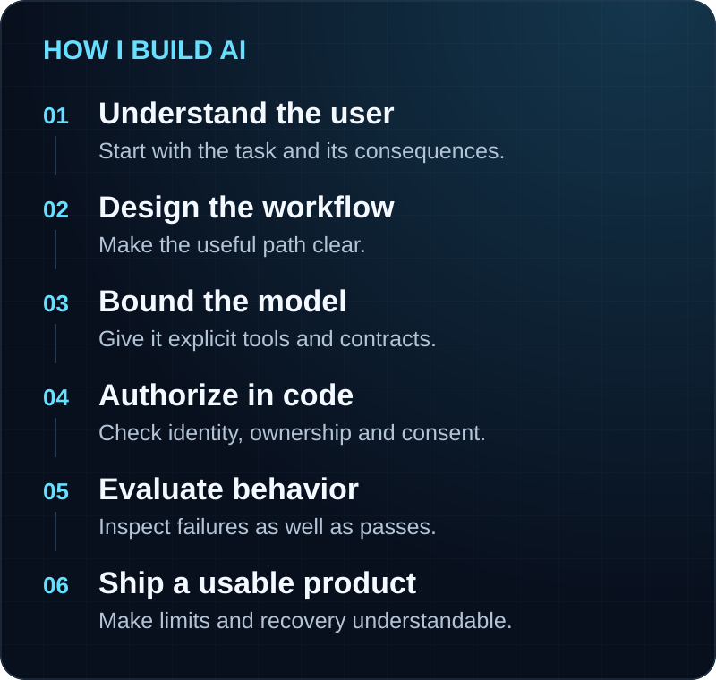

# Abdulelah Alkhathami

**AI Product Builder · Arabic-first AI Systems** 
LLM Applications · Agentic Workflows · Trustworthy AI

I build AI products around useful workflows, explicit boundaries, and behavior we can evaluate.

[Portfolio](https://abdulelah.de) · [Projects](#featured-work) · [LinkedIn](https://linkedin.com/in/abdulelah-alkhathami-853845311) · [Contact](mailto:me@abdulelah.de)

أبني منتجات ذكاء اصطناعي تبدأ من احتياج المستخدم، بصلاحيات واضحة ونتائج قابلة للتقييم.

## AI Mission Control

**An illustrative challenge:** the guard passes the message. The model requests another customer's order. What should the system do?

**[Allow the call →](missions/allow.md)** · **[Verify authorization →](missions/verify.md)** · **[Escalate →](missions/escalate.md)**

The model can request an action. **The system decides whether it is allowed.** 
[How this works](missions/README.md) · [Inspect the real Raqmi implementation](https://github.com/Abdulel3h/llm-application-engineering-Raqmi/blob/main/TOOL_CALLING.md)

## What I build

- **AI products** — domain-aware LLM applications with clear user workflows.
- **Agentic systems** — tool calling, bounded orchestration, authorization and escalation paths.
- **Trustworthy behavior** — structured outputs, guardrails and inspectable evaluations.
- **Product experience** — Arabic/English interfaces that make complex tasks approachable.

## Featured work

**[Raqmi](https://github.com/Abdulel3h/llm-application-engineering-Raqmi)** — a fictional-store notebook case study connecting bilingual support to application-authorized tools. Inspect native tool transcripts, independent ownership checks, and captured DeepSeek/ALLaM evaluations.

**[Abdulelah AI Portfolio](https://github.com/Abdulel3h/Abdulelah)** — a Next.js portfolio that connects typed project facts, bilingual content and a server-side assistant. The engineering challenge: keeping the interface and assistant grounded in the same identity and work.

**[Architect of Intelligence](https://github.com/Abdulel3h/architect-of-intelligence)** — a bilingual workflow prototype for opportunity scans and architecture generation. Zod contracts and deterministic fallbacks keep outputs usable when optional AI integrations are unavailable.

**Also explore:** [ChatUB](https://github.com/Abdulel3h/ChatUB), local Arabic FAQ retrieval and generation · [Absher Insight](https://github.com/Abdulel3h/absher-insight), synthetic behavioral-risk analytics · [Stadium](https://github.com/Abdulel3h/Stadium), vision-based gate monitoring.

## How I build AI

Evaluation means reading the failures, too. Prototype results stay separate from production claims.

## Selected stack

| Layer | Demonstrated in my repositories |
|---|---|
| AI engineering | Python · Pydantic · LLM tool calling · SentenceTransformers · Ollama |
| Backend | FastAPI · Flask · server-side API routes · Zod |
| Product / frontend | TypeScript · React · Next.js · TanStack Start |
| Infrastructure | Local vLLM inference · Vercel deployment configuration |

[Review the evidence](docs/recruiter-review-path.md) · [Repository map](docs/repository-strategy.md) · **[Let's talk](mailto:me@abdulelah.de)**
