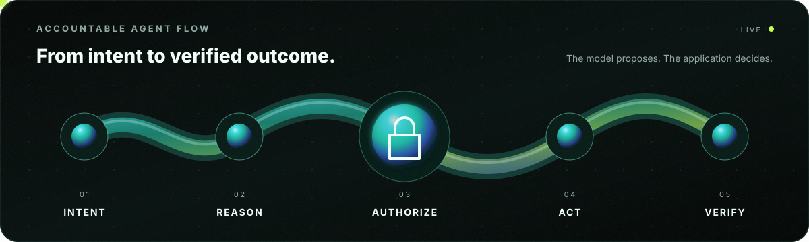
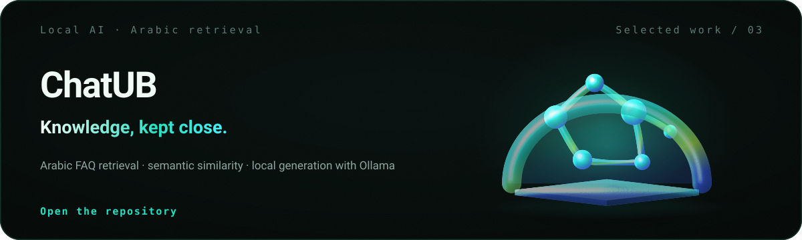
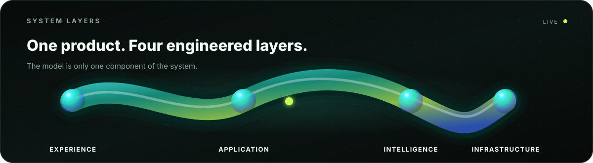

### Abdulelah Alkhathami · عبدالإله الخثعمي

**AI Product Builder · Arabic-first AI Systems** 
I turn complex workflows into useful, accountable AI products.

[**Portfolio**](https://abdulelah.de) &nbsp;·&nbsp; [**LinkedIn**](https://linkedin.com/in/abdulelah-alkhathami-853845311) &nbsp;·&nbsp; [**Email**](mailto:me@abdulelah.de)

أبني أنظمة ذكاء اصطناعي تحوّل التعقيد إلى تجربة واضحة، مفيدة، وجديرة بالثقة.

## Systems, not demos

I build around the whole decision path: understand the user, ground the model, authorize every sensitive action in application code, then evaluate the outcome. The LLM may propose an action; **the product remains responsible for whether it happens.**

## Selected systems

**[Raqmi](https://github.com/Abdulel3h/llm-application-engineering-Raqmi)** — a bilingual retail-support case study with native tool calls, structured outputs, application-owned authorization, guardrails, and captured evaluation evidence.

**[Abdulelah.de](https://github.com/Abdulel3h/Abdulelah)** — a bilingual Next.js portfolio where typed project facts and a server-side AI assistant share one source of truth.

**[ChatUB](https://github.com/Abdulel3h/ChatUB)** — a local Arabic academic-assistance prototype combining FAQ retrieval, semantic similarity, and Ollama-based generation.

## How I engineer the product

| Layer | What I work with |
|---|---|
| **Experience** | Arabic / English UX · workflow design · clear failure states |
| **Application** | Python · FastAPI · TypeScript · Next.js · React · Pydantic · Zod |
| **Intelligence** | LLM tool calling · RAG · embeddings · structured outputs · evaluation |
| **Infrastructure** | PostgreSQL · pgvector · Redis · Docker · local inference |

## Engineering principles

- **Useful before impressive.** Start with the real workflow and the person using it.
- **Trust is engineered.** Authorization, evidence, observability, and human control live outside the prompt.
- **Complexity stays behind the interface.** The system can be sophisticated; the experience should feel simple.
- **Evaluation includes failure.** A prototype result is not a production claim.

### Building the next generation of trusted AI products—from Saudi Arabia to the world.

[**Explore my work**](https://abdulelah.de) &nbsp;·&nbsp; [**Start a conversation**](mailto:me@abdulelah.de)

