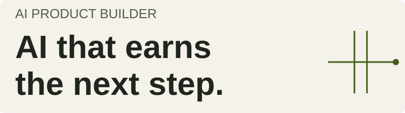
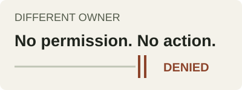
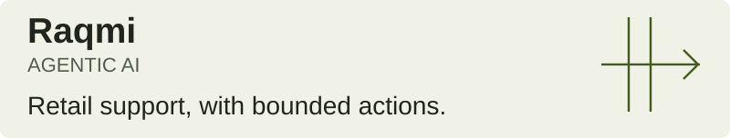
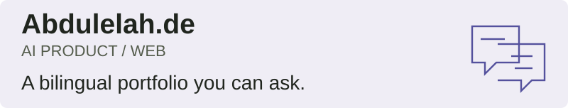
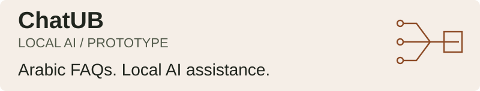

<picture>
  <source media="(max-width: 600px) and (prefers-color-scheme: dark)" srcset="assets/profile/hero-mobile-dark.svg">
  <source media="(max-width: 600px)" srcset="assets/profile/hero-mobile-light.svg">
  <source media="(prefers-color-scheme: dark)" srcset="assets/profile/hero-dark.svg">
  
</picture>

**Abdulelah Alkhathami · عبدالإله الخثعمي** 
Arabic-first AI, from model behavior to product experience.

<picture>
  <source media="(max-width: 600px) and (prefers-color-scheme: dark)" srcset="assets/profile/permission-mobile-dark.svg">
  <source media="(max-width: 600px)" srcset="assets/profile/permission-mobile-light.svg">
  <source media="(prefers-color-scheme: dark)" srcset="assets/profile/permission-dark.svg">
  
</picture>

Illustrative [Raqmi](https://github.com/Abdulel3h/llm-application-engineering-Raqmi) flow. Ownership + explicit consent come before a return.

Inspect the denied path: someone else’s order

<picture>
  <source media="(prefers-color-scheme: dark)" srcset="assets/profile/denied-dark.svg">
  
</picture>

The model’s request grants no authority. The application blocks access; no return is created.

[Inspect the boundary in code](https://github.com/Abdulel3h/llm-application-engineering-Raqmi/blob/615302c3388ece90c7a94c90c802082dac47f920/raqmi_tool_calling.py) · [Read the tests](https://github.com/Abdulel3h/llm-application-engineering-Raqmi/blob/615302c3388ece90c7a94c90c802082dac47f920/tests/test_tool_calling.py)

### Selected work

<a href="https://github.com/Abdulel3h/llm-application-engineering-Raqmi">
<picture>
  <source media="(max-width: 600px) and (prefers-color-scheme: dark)" srcset="assets/projects/raqmi-mobile-dark.svg">
  <source media="(max-width: 600px)" srcset="assets/projects/raqmi-mobile-light.svg">
  <source media="(prefers-color-scheme: dark)" srcset="assets/projects/raqmi-dark.svg">
  
</picture>
</a>

<a href="https://github.com/Abdulel3h/Abdulelah">
<picture>
  <source media="(max-width: 600px) and (prefers-color-scheme: dark)" srcset="assets/projects/portfolio-mobile-dark.svg">
  <source media="(max-width: 600px)" srcset="assets/projects/portfolio-mobile-light.svg">
  <source media="(prefers-color-scheme: dark)" srcset="assets/projects/portfolio-dark.svg">
  
</picture>
</a>

<a href="https://github.com/Abdulel3h/ChatUB">
<picture>
  <source media="(max-width: 600px) and (prefers-color-scheme: dark)" srcset="assets/projects/chatub-mobile-dark.svg">
  <source media="(max-width: 600px)" srcset="assets/projects/chatub-mobile-light.svg">
  <source media="(prefers-color-scheme: dark)" srcset="assets/projects/chatub-dark.svg">
  
</picture>
</a>

### What I build

- **AI products** — Useful workflows around a model.
- **Agentic systems** — Tools with explicit boundaries.
- **Trustworthy AI** — Authorization, guardrails, and evaluation.
- **Product experience** — Clear interfaces in Arabic and English.

**AI** · Python · Pydantic · Ollama · Sentence Transformers 
**Backend** · FastAPI · Flask 
**Product** · TypeScript · Next.js · React · Tailwind CSS

[Explore my portfolio](https://abdulelah.de) · [LinkedIn](https://linkedin.com/in/abdulelah-alkhathami-853845311) · [Email](mailto:me@abdulelah.de)
