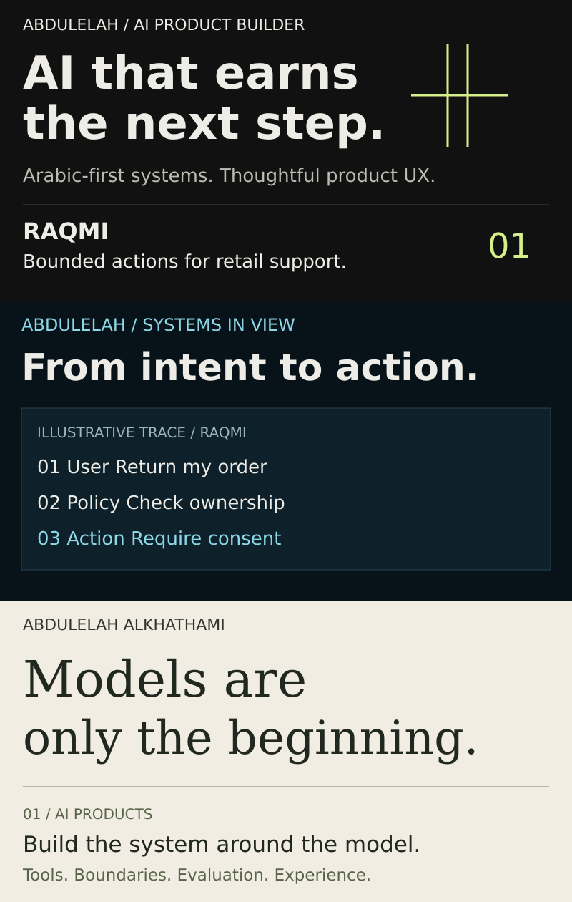

# Profile v2 · review report

**Direction: The Permission Moment.** Abdulelah builds Arabic-first AI products and the systems around their models. The paired-line gate expresses that an action must earn permission. Review the [branch README](https://github.com/Abdulel3h/Abdulel3h/blob/design/profile-v2/README.md). This is a branch-only delivery; the account homepage still uses `main`.

## 1–4. References, useful lessons, extracted and rejected patterns

Twenty references were studied: Anthony Fu, Sindre Sorhus, Paco Coursey, Simon Willison, shadcn, Lee Robinson, Andrej Karpathy, Peter Steinberger, Evan You, Dan Abramov, Kent C. Dodds, Mark Otto, Shu Ding, Guillermo Rauch, Matt Pocock, Josh W. Comeau, Cassidy Williams, Theo Browne, Anurag Hazra and Nicky Case. The [benchmark](benchmark.md) links every primary source, explains selection signals, and records all twenty requested design criteria for each reference.

The useful pattern is short positioning, named work, inspectable evidence and a small number of clear destinations. Meaningful interaction should relate to the creator's work. Long catalogs, status widgets, badge walls, generic terminal/typing effects, excessive neon and reputation-dependent minimalism were rejected. No views or popularity rankings were invented; none of the reference designs was copied.

## 5. Why replace the current design

The old 800 × 500 hero, 800 × 500 mission graphic, 800 × 760 process graphic and six large project covers made the profile feel like documentation. Repeated colors and process diagrams flattened project identity. Technical detail competed with the opening and primary project. The [audit](public-audit.md) explains the critique.

## 6–7. Account audit and capability synthesis

Every accessible repository's visibility/archive state, available tree, README and relevant implementation evidence was reviewed. The current public set has five project repositories and the profile; none is archived. [Public audit and claim map](public-audit.md).

The confidential portion of the review influences only broad capabilities: AI systems, backend engineering, data workflows and product interfaces. No confidential identifiers, examples, source, architecture, links or measurements appear in this delivery. Specific homepage claims are grounded in public work.

## 8. Positioning

**Abdulelah Alkhathami · AI Product Builder.** Arabic-first AI systems, controlled tools, evaluation and thoughtful product UX. “AI that earns the next step” is a design philosophy, not a claim of production reliability. No seniority, employer, client, user-count or deployment claims were added.

## 9–10. Three directions and the choice

| Direction | Memorability | Clarity | Technical credibility | Mobile | Originality | Restraint |
|---|---|---|---|---|---|---|
| A · Product launch | Strong gate mark and phrase | Immediate AI identity | Needs an evidence-linked interaction | Short hero adapts well | Original permission metaphor | Strong |
| B · Observability | Recognizable trace | Literal engineering explanation | Strong but documentation-like | Dense trace rows shrink poorly | Risk of generic dashboard language | Moderate |
| C · Editorial engineering | Expressive typography | More abstract opening | Relies on following copy | Longer line lengths | Distinct, but less AI-specific | Strong |

A won, with the permission boundary from B as one compact experience. C's spacious hierarchy informed restraint without copying its typography. These are editorial design judgments, not research with participants.

Refinement 1: reduced the hero to 224px, replaced the log-like trace with a single boundary, limited work to three compact cards and gave each project its own mark. [First refinement](design/round-1.png).

Refinement 2: added mobile-specific compositions and light/dark palettes; enlarged readable text, softened project-specific surfaces, and limited motion to one 4.6-second pass. [Mobile refinement](design/round-2-mobile.png). Final QA further enlarged category labels and made ChatUB's retrieval wording more precise.

## 11. README structure and density

Hero → bilingual identity → illustrative permission trace and one disclosure → three selected projects → four capabilities → ten demonstrated technologies → three contact destinations.

At 800px artwork width, the primary illustrations total 902px of height, down from 4,160px in the old sequence: **78.3% less illustration height**. This is an asset-height comparison, not a claimed browser page-height measurement. The hero alone is 55.2% shorter. Technical evidence and review documentation stay in linked repositories and these report files.

## 12. Signature experience

The signal moves toward a paired-line gate, pauses, then proceeds. The complete “Propose → Authorize → Act” message is available in a static frame. The caption explicitly labels the scenario illustrative and names ownership plus explicit return consent.

“Inspect the denied path” is a native GitHub `details/summary` disclosure. It reveals a refusal illustration and links directly to the public authorization implementation and tests. It does not execute an LLM, make API calls or simulate production telemetry. Unsupported animation still leaves a meaningful diagram; reduced-motion CSS disables motion. [Design and implementation notes](design-system.md).

## 13–14. Flagships and pins

Flagships: **1. Raqmi; 2. Abdulelah.de; 3. ChatUB.** The [audit](public-audit.md) scores technical depth, completeness, originality, documentation, product value, visual quality, AI relevance, evidence and first impression, with limitations stated.

Exact public pin order: `llm-application-engineering-Raqmi`, `Abdulelah`, `ChatUB`, `absher-insight`, `Stadium`, then optionally `Abdulel3h`. There are only five public project repositories; the sixth slot is explicitly the profile design artifact. No sixth AI product is invented. [Pin instructions](github-settings.md).

## 15. Created files

| Area | Deliverables |
|---|---|
| Homepage | [README.md](../README.md) |
| Hero | [Light](../assets/profile/hero-light.svg), [dark](../assets/profile/hero-dark.svg), [mobile light](../assets/profile/hero-mobile-light.svg), [mobile dark](../assets/profile/hero-mobile-dark.svg) |
| Signature | [Light](../assets/profile/permission-light.svg), [dark](../assets/profile/permission-dark.svg), [mobile light](../assets/profile/permission-mobile-light.svg), [mobile dark](../assets/profile/permission-mobile-dark.svg), [denied light](../assets/profile/denied-light.svg), [denied dark](../assets/profile/denied-dark.svg) |
| Compact cards | [Raqmi](../assets/projects/raqmi-light.svg), [portfolio](../assets/projects/portfolio-light.svg), [ChatUB](../assets/projects/chatub-light.svg), each with dark and mobile variants in [assets/projects](../assets/projects) |
| Social previews | Six SVG masters and six PNGs in [assets/social](../assets/social); [family overview](design/social-previews.png) |
| Research / review | [Benchmark](benchmark.md), [public audit](public-audit.md), [design system](design-system.md), [settings](github-settings.md), this report and [visual iterations](design) |
| Reproducible artwork | [SVG generator](../tools/build_profile.py), [social renderer](../tools/render_social.cjs) |

## 16. Replaced and removed presentation

Replaced the root README and the previous hero, mission-control, process and project-card families. Retired the legacy mission pages and supporting presentation documents; the replacement documents above form the new review path. All changes are on the redesign branch. Main and earlier commits remain intact; no history was rewritten. Application repositories, test files and historical evaluation results were not changed.

## 17. Metadata recommendations

Exact bio, descriptions, topics, homepage treatment, display-name guidance, pin order and six social-preview mappings are in [GitHub settings](github-settings.md). Raqmi's empty About/topics need the most attention. Other descriptions should clarify prototype scope and align the product-builder identity. The profile-only branch contains proposed assets and copy; it does not change global repository settings before review.

## 18. Security, accessibility and validation

Validation results are recorded in [verification](verification.md). Scope is the redesigned branch tip and generated assets. Public-only destinations, confidential-identifier screening, credential-pattern screening, relative links, SVG active-content restrictions, asset dimensions, text bounds, contrast, reduced-motion fallback and image payload sizes are checked before publishing. No GitHub Actions, external widget dependency, model call or credential is introduced. This is not a claim of a clean historical Git archive or a production security certification.

The four-persona review below is a design simulation, not real visitor testing or measured timing.

| Visitor | Five-second identity | Ten-second flagship | Credibility / amateur risk | Memorable cue and likely next click |
|---|---|---|---|---|
| AI engineer | AI Product Builder, Arabic-first | Raqmi is first | Direct code/tests; explicit illustrative label | Permission boundary → tool implementation |
| Technical founder | Models connected to product workflows | Raqmi, then portfolio | No adoption or revenue claims | Gate plus product UX → portfolio |
| Recruiter | Name, role, bilingual focus | First compact card | No seniority inflation or noisy skill wall | Clear identity → Raqmi / contact |
| Enterprise technology executive | Controlled AI actions | Raqmi | Prototype scope; no deployment assurances | Ownership and consent → public evidence |

## 19–20. Commit and branch

Base main commit: `e4933457a9510c4d2bbdecc518cae789be6d0bfc`, retrieved from GitHub and verified against the local checkout before branch creation. Profile v2 was published to `design/profile-v2` in commit `6829d088f6a7f0efde5bea00407252855e2e1210`.

During publication, `main` briefly advanced to that design commit. It was immediately restored with the forward revert commit `b356acfaab4c84994f47cde4490a6ce6bb83045a`; its tree is byte-for-byte the same as the original base tree. History was preserved and no force update was used. The redesign remains isolated on [design/profile-v2](https://github.com/Abdulel3h/Abdulel3h/tree/design/profile-v2), where GitHub's rendered README was inspected successfully. Because it is not the default branch, it does not replace the account homepage.

## 21. Manual changes remaining

Review the branch first. After separate approval, merge it to `main`, edit the public bio/website, set the pin order, apply About/topics recommendations and upload each matching social PNG through repository settings. [Exact UI steps and values](github-settings.md). The unintended `main` update has already been neutralized by the history-preserving revert above; the current `main` content is the prior profile.
